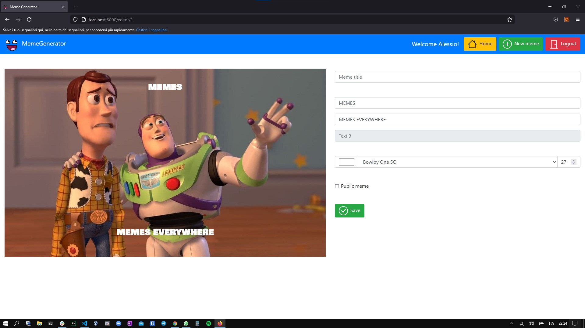

# Exam #2: "Meme Generator"
## Student: s281557 CORVAGLIA ALESSIO

## React Client Application Routes

- Route `/`: Home page of the app, it shows the list of all memes if the user is logged in, public memes only if the user is not logged in.
- Route `/view/:id`: It shows the meme and its info. :id is the parameter that indicates the id of the meme to show.
- Route `/imgchooser`: It shows the list of base images available from which to start in order to create a new meme.
- Route `/editor/:id`: It shows the editor for the creation of a new meme and the real time render of the meme while creating it. :id is the parameter that indicates the id of the base image used for the meme creation.
- Route `/copy/:id`: It shows the editor for the creation of a new meme starting from an existing meme and the real time render of the meme while copying it. :id is the parameter that indicates the id of meme used as a base for the copy creation.

## API Server
All request and response bodies are exchanged in JSON.

## HTTP method: `POST`  URL: `/api/sessions`
* Description: Perform the user login
* Request body: Credential of the user that is trying to login `username, password`
* Response: `200 OK` (success)
* Response body: Info about the logged in user
  `id, username, name`
* Error responses:  `500 Internal Server Error` (generic error), `401 Unauthorized User` (user is not logged in)

## HTTP method: `DELETE`  URL: `/api/sessions/current`
* Description: Perform the user logout
* Request body: //     
* Response: `200 OK` (success)
* Response body: //
* Error responses:  `500 Internal Server Error` (generic error), `401 Unauthorized User` (user is not logged in)

## HTTP method: `GET`  URL: `/api/sessions/current`
* Description: Check if the user is logged in
* Request body: //     
* Response: `200 OK` (success)
* Response body: Info about the logged in user
  `id, username, name`
* Error responses:  `500 Internal Server Error` (generic error), `401 Unauthorized User` (user is not logged in)

## HTTP method: `GET`  URL: `/api/memes/all`
* Description: Allows the retrieve information about all memes 
* Request body: //    
* Response: `200 OK` (success)
* Response body: A list of memes, each with the following properties
  `id, title, imageid, pub, userid, name, copy, color, font, size, text1, text2, text2`
* Error responses:  `500 Internal Server Error` (generic error), `401 Unauthorized User` (user is not logged in)

## HTTP method: `GET`  URL: `/api/memes/public`
* Description: Allows the retrieve information about public memes
* Request body: //    
* Response: `200 OK` (success)
* Response body: A list of memes, each with the following properties
  `id, title, imageid, pub, userid, name, copy, color, font, size, text1, text2, text2`
* Error responses:  `500 Internal Server Error` (generic error)

## HTTP method: `GET`  URL: `/api/images/file/:id`
* Description: Allows the retrieve an image from the server
* Request body: //    
* Response: `200 OK` (success)
* Response body: An image file
* Error responses:  `500 Internal Server Error` (generic error)

## HTTP method: `GET`  URL: `/api/images/info`
* Description: Allows the retrieve information about all images
* Request body: //    
* Response: `200 OK` (success)
* Response body: A list of images, each with the following properties
  `id, path, upleft, upcenter, upright, centerleft, centercenter, centerright, downleft, downcenter, downright `
* Error responses:  `500 Internal Server Error` (generic error)

## HTTP method: `GET`  URL: `/api/fonts`
* Description: Allows the retrieve information about fonts
* Request body: //    
* Response: `200 OK` (success)
* Response body: A list of fonts, each with the following properties
  `id, font`
* Error responses:  `500 Internal Server Error` (generic error)

## HTTP method: `POST`  URL: `/api/memes`
* Description: Allows to insert a new meme
* Request body: A meme, with the following properties 
  `title, imageid, pub, userid, copy, color, fontid, size, text1, text2, text3`  
* Response: `201 Created` (success)
* Response body: A list of fonts, each with the following properties
  `id, font`
* Error responses:  `503 Service unavailable` (database error), `422 Unprocessable entity` (errors in the request body content), `401 Unauthorized User` (user is not logged in)

## HTTP method: `DELETE`  URL: `/api/memes/:id`
* Description: Allows to delete a meme of the logged in user
* Request body: //
* Response: `204 Deleted` (success)
* Response body: //
* Error responses:  `503 Service unavailable` (database error), `401 Unauthorized User` (user is not logged in)

## Database Tables

- Table `fonts` - contains id, font
- Table `images` - contains id, path, upleft, upcenter, upright, centerleft, centercenter, centerright, downleft, downcenter, downright
- Table `memes` - contains id, title, imageid, pub, userid, copy, color, fontid, size, text1, text2, text3
- Table `users` - contains id, email, name, hash

## Main React Components

- `ImageCard` (in `ImageCard.js`): it creates a single card to represent an image in the list of available images. It offers a button to create a new meme starting from that image.
- `ImageChooser` (in `ImageChooser.js`): it creates a list of ImageCard components in a grid view, to show all available images.
- `LoginModal` (in `LoginModal.js`): it is the modal used to perform the login.
- `MemeCard` (in `MemeCard.js`): it creates a single card to represent a meme in the list of memes in the home page. It offers three buttons to view, copy and delete the meme. It is also used in the MemeDetail component to show the infos together with the meme, in this case the view button is not shown.
- `MemeChooser` (in `MemeChooser.js`): it creates a list of MemeCard components in a grid view to show all available memes (or public only memes if user is not logged in).
- `MemeDetails` (in `MemeDetails.js`): it is used to visualize a meme. It uses a two column view, one column for visualizing the meme with the MemeViewer component and one column for showing its details using a MemeCard component.
- `MemeEditor` (in `MemeEditor.js`): it is used to edit a meme and visualize the results in real time. It uses a two column view, one column for visualizing the meme with the MemeViewer component and one column contains the form to compile in order to create a new meme, either from scratch or by starting from an existing meme (a copy operation).
- `MemeViewer` (in `MemeViewer.js`): it is used to visualize a meme. It uses a background image and a 3x3 grid to visualize overlapped texts in the right positions defined by the base image.
- `Navigation` (in `Navigation.js`): it is used for the creation of the navbar on top of the application. It contains the app logo, login/logout buttons, home button and when a user is logged in, the button for the creation of a new meme.
- `Notify` (in `Notify.js`): it is used to visualize alerts like "operation performed successfully", "user not logged in" or "non existing page"

## Screenshot

## Users Credentials

- NAME: Alessio USERNAME: test1@polito.it, PASSWORD: test1 
(He has created memes: "One does not simply..", "Computer engineer's sad life", "SDP.. but in red" (this last one is a copy of John's meme))

- NAME: John USERNAME: test2@polito.it, PASSWORD: test2 
(He has created memes: "WA1 Exam", "SDP", "One does not simply (2) (this last one is a copy of Alessio's meme)")

- NAME: Peter USERNAME: test3@polito.it, PASSWORD: test3 
(He has created memes: "20 Euros", "Memes everywhere", "Computer engineer's sad life" (this last one is a copy of Alessio's meme))
